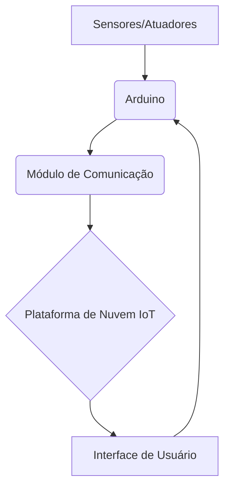

# Arquitetura de IoT com Arduino

## Descrição
Este projeto explora a utilização do Arduino como um dispositivo de borda em arquiteturas de Internet das Coisas (IoT), focando em sua simplicidade e versatilidade para prototipagem e pequenos projetos.

## Componentes Principais

*   **Arduino (Ex: Arduino Uno, ESP8266, ESP32):** Microcontrolador para coletar dados de sensores e controlar atuadores. Embora o ESP8266/ESP32 sejam mais comuns para IoT devido ao Wi-Fi integrado, o Arduino Uno pode ser usado com módulos de comunicação.
*   **Sensores e Atuadores:** Conectados diretamente ao Arduino para interagir com o ambiente (ex: sensor de temperatura, LED, relé).
*   **Módulo de Comunicação (Opcional para Arduino Uno):** Wi-Fi (ESP8266), Bluetooth, Ethernet Shield, LoRa, GSM/GPRS para conectar o Arduino à internet ou a um gateway.
*   **Gateway IoT (se necessário):** Para agregar dados de múltiplos Arduinos ou para conectar Arduinos sem conectividade direta à internet.
*   **Plataforma de Nuvem IoT:** Serviços como Blynk, ThingSpeak, Ubidots, ou plataformas maiores como AWS IoT, Google Cloud IoT, Azure IoT Hub para visualização, armazenamento e processamento de dados.
*   **Interface de Usuário:** Aplicativo móvel ou dashboard web para monitoramento e controle.

## Fluxo de Dados
1.  Sensores coletam dados e os enviam para o Arduino.
2.  Arduino processa os dados e, se configurado, os envia via módulo de comunicação para a internet.
3.  Os dados chegam a um gateway (se houver) e/ou diretamente à plataforma de nuvem IoT.
4.  A plataforma de nuvem armazena, analisa e disponibiliza os dados para a interface do usuário.
5.  O usuário pode enviar comandos através da interface para o Arduino, que controla os atuadores.

## Vantagens do Arduino em IoT
*   **Custo-benefício:** Placas e componentes acessíveis.
*   **Comunidade:** Grande comunidade de desenvolvedores e vasta documentação.
*   **Facilidade de Uso:** Ideal para iniciantes e prototipagem rápida.
*   **Flexibilidade:** Grande variedade de shields e módulos.

## Diagrama Simplificado

