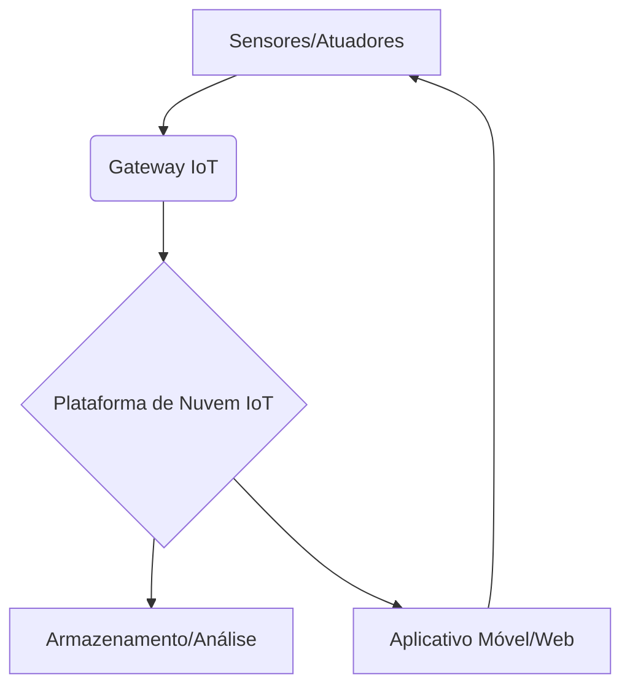

# Arquitetura de IoT para Casa Inteligente

## Descrição
Este projeto descreve uma arquitetura básica para um sistema de casa inteligente, focando na automação e monitoramento de dispositivos residenciais.

## Componentes Principais

*   **Dispositivos de Borda (Edge Devices):** Sensores (temperatura, umidade, movimento), atuadores (lâmpadas inteligentes, termostatos), câmeras de segurança.
*   **Gateway IoT:** Dispositivo responsável por coletar dados dos dispositivos de borda, realizar pré-processamento e enviá-los para a nuvem. Pode ser um Raspberry Pi ou um hub comercial.
*   **Plataforma de Nuvem IoT:** Serviços de nuvem (AWS IoT, Google Cloud IoT, Azure IoT Hub) para ingestão de dados, armazenamento, processamento e análise.
*   **Aplicativo Móvel/Web:** Interface para o usuário monitorar e controlar os dispositivos da casa inteligente.

## Fluxo de Dados
1.  Sensores coletam dados do ambiente.
2.  Dados são enviados para o Gateway IoT.
3.  Gateway pré-processa os dados e os envia para a plataforma de nuvem.
4.  Plataforma de nuvem armazena, analisa e processa os dados.
5.  Aplicativo móvel/web exibe os dados e permite o controle dos dispositivos.

## Diagrama Simplificado

