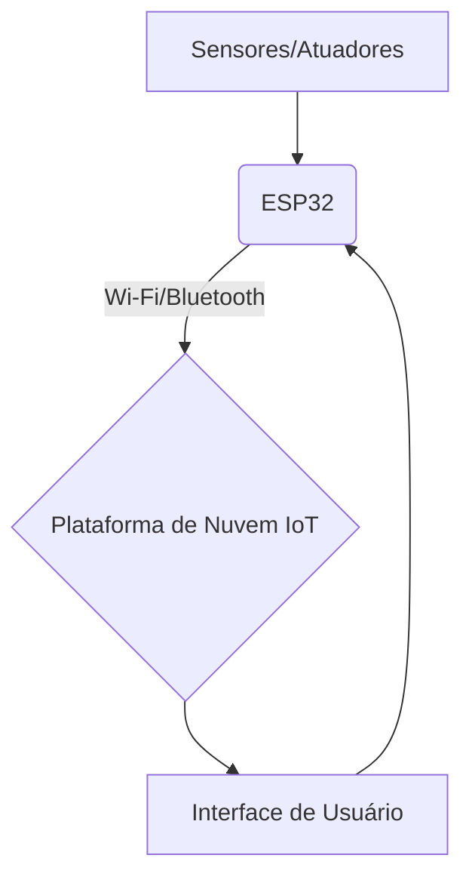

# Arquitetura de IoT com ESP32

## Descrição
Este projeto detalha a arquitetura de soluções de Internet das Coisas (IoT) utilizando o microcontrolador ESP32, destacando suas capacidades de conectividade Wi-Fi e Bluetooth integradas, que o tornam ideal para uma vasta gama de aplicações IoT.

## Componentes Principais

*   **ESP32:** Microcontrolador com Wi-Fi e Bluetooth integrados, ideal para coletar dados de sensores, controlar atuadores e se comunicar diretamente com a internet ou outros dispositivos.
*   **Sensores e Atuadores:** Conectados diretamente aos pinos GPIO do ESP32 para interagir com o ambiente (ex: sensor de temperatura e umidade DHT11, relé para controle de lâmpadas, motores).
*   **Plataforma de Nuvem IoT:** Serviços como AWS IoT Core, Google Cloud IoT Core, Azure IoT Hub, ou plataformas mais simples como Blynk, ThingSpeak, Ubidots para ingestão de dados, armazenamento, processamento, análise e visualização.
*   **Interface de Usuário:** Aplicativo móvel (Android/iOS), dashboard web ou assistente de voz para monitoramento, controle e interação com o sistema IoT.

## Fluxo de Dados
1.  Sensores coletam dados do ambiente e os enviam para o ESP32.
2.  O ESP32 processa os dados e os envia diretamente para a plataforma de nuvem IoT via Wi-Fi.
3.  A plataforma de nuvem armazena, analisa e disponibiliza os dados para a interface do usuário.
4.  O usuário pode enviar comandos através da interface (aplicativo, web) para a plataforma de nuvem, que os retransmite para o ESP32.
5.  O ESP32 recebe os comandos e controla os atuadores correspondentes.

## Vantagens do ESP32 em IoT
*   **Conectividade Integrada:** Wi-Fi e Bluetooth Low Energy (BLE) em um único chip, simplificando o design e reduzindo custos.
*   **Alto Desempenho:** Processador dual-core, permitindo tarefas mais complexas e processamento de dados local.
*   **Baixo Consumo de Energia:** Modos de baixo consumo ideais para aplicações alimentadas por bateria.
*   **Custo-benefício:** Solução poderosa e acessível para desenvolvimento de produtos IoT.
*   **Flexibilidade:** Suporte a diversas linguagens de programação (Arduino IDE, MicroPython, ESP-IDF).

## Diagrama Simplificado

