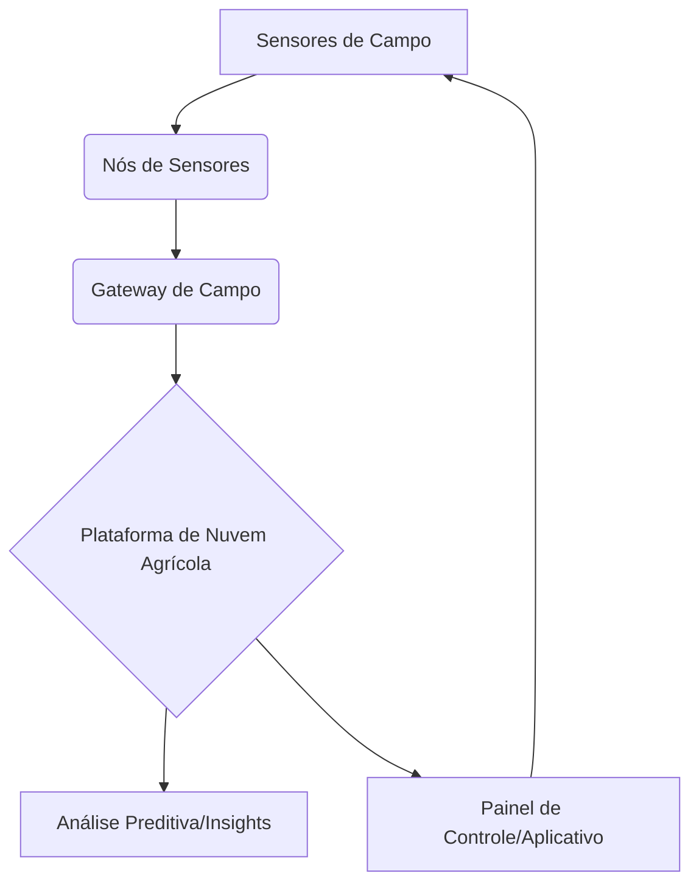

# Arquitetura de IoT para Monitoramento Agrícola Inteligente

## Descrição
Este projeto detalha uma arquitetura de IoT para monitoramento de lavouras e otimização da produção agrícola, utilizando sensores e análise de dados.

## Componentes Principais

*   **Sensores de Campo:** Sensores de solo (umidade, pH, nutrientes), sensores climáticos (temperatura, umidade do ar, velocidade do vento), câmeras para monitoramento de culturas.
*   **Nós de Sensores (Sensor Nodes):** Dispositivos de baixo consumo de energia que coletam dados dos sensores e os transmitem para um gateway.
*   **Gateway de Campo:** Coleta dados dos nós de sensores, agrega-os e os envia para a plataforma de nuvem, geralmente via redes de longa distância (LoRaWAN, NB-IoT).
*   **Plataforma de Nuvem Agrícola:** Serviços de nuvem especializados para agricultura (ex: Azure FarmBeats, IBM Watson IoT Platform) para armazenamento, processamento, análise preditiva e geração de insights.
*   **Painel de Controle/Aplicativo:** Interface para agricultores visualizarem dados, receberem alertas e tomarem decisões informadas sobre irrigação, fertilização e controle de pragas.

## Fluxo de Dados
1.  Sensores de campo coletam dados ambientais e de cultura.
2.  Nós de sensores transmitem os dados para o Gateway de Campo.
3.  Gateway de Campo envia os dados agregados para a plataforma de nuvem.
4.  Plataforma de nuvem processa, analisa e gera insights acionáveis.
5.  Painel de controle/aplicativo exibe informações e recomendações aos agricultores.

## Diagrama Simplificado

